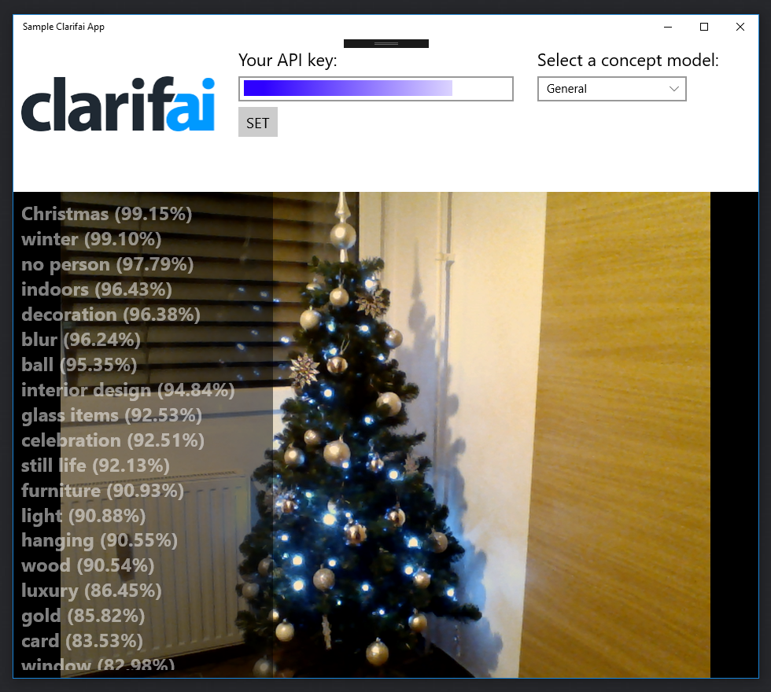

# Quickstart Clarifai .NET UWP Sample Project

This is an example project built using the [Clarifai C# API Client](https://github.com/clarifai/clarifai-csharp).

Point your camera towards an object or person(s) and recognize concepts and faces in real time with the Clarifai predict.

## Requirements

* [UWP 10.0+](https://www.visualstudio.com/vs/universal-windows-platform/)
* A Clarifai account - [sign up for free](https://clarifai.com/developer/account/signup?utm_source=github&utm_medium=readme&utm_campaign=clarifai%2Fquickstart-uwp-claire)

## Getting Started

Clone the repo and open the project using Visual Studio.

```bash
git clone git@github.com:Clarifai/quickstart-csharp-uwp-claire.git
```


